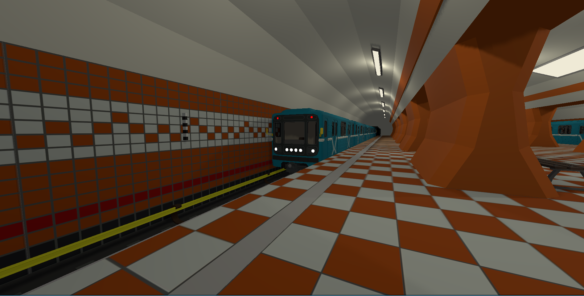
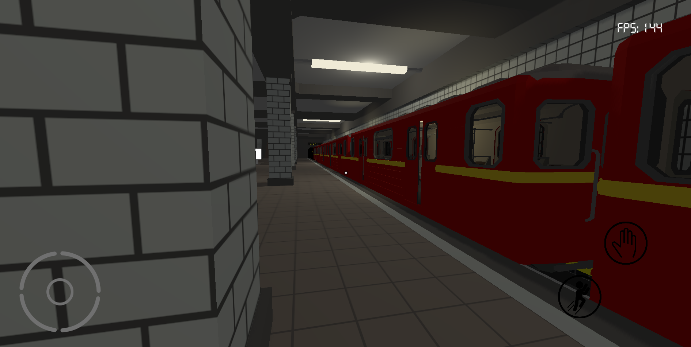

# SubwayRussian

**Симулятор российского метро — исходники, модели, текстуры, код**

## О проекте

Этот архив содержит исходные файлы моего проекта SubwayRussian. Здесь собрана сцена(правда не доконца), 3D-модели станций и поездов, текстуры, код, а также все необходимые материалы для запуска и дальнейшей разработки.

## Можно использовать!

Модели, текстуры, программный код — всё предоставляется свободно для любых целей:  
* Изучайте  
* Дорабатывайте  
* Встраивайте в свои проекты  
* Делайте модификации

Единственная просьба: **указывайте меня как автора** (PRAVDA_SEMPAI).

## 📱 Соцсети

Следите за обновлениями и другими проектами:

[
[
[
[

## Лицензия

**Свободное использование с указанием авторства.**  
Можете использовать материалы для некоммерческих и коммерческих проектов, при условии ссылки на автора.

## Контакты

Если вы продолжите работу над проектом или внедрите его в свой продукт — будет круто, если скинете ссылку или просто дадите знать!

---

**Спасибо всем, кто вдохнёт жизнь в эту игру! 🚇**
**Автор: PRAVDA_SEMPAI**
